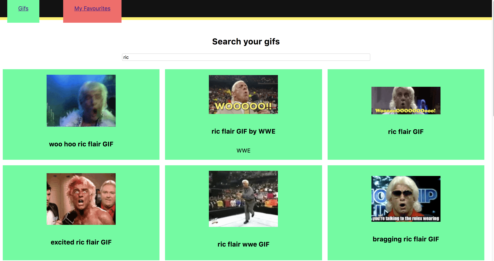
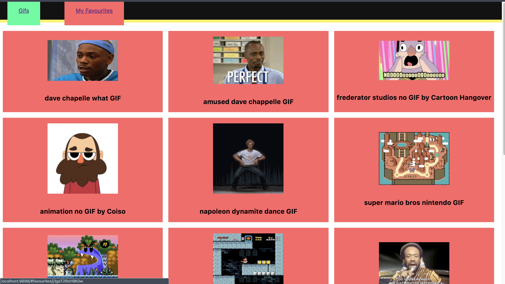
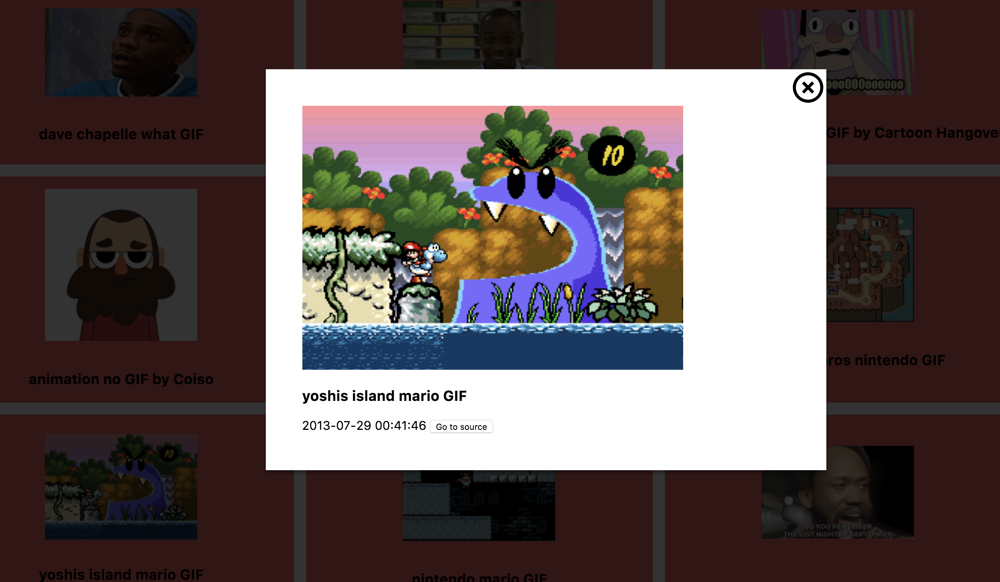
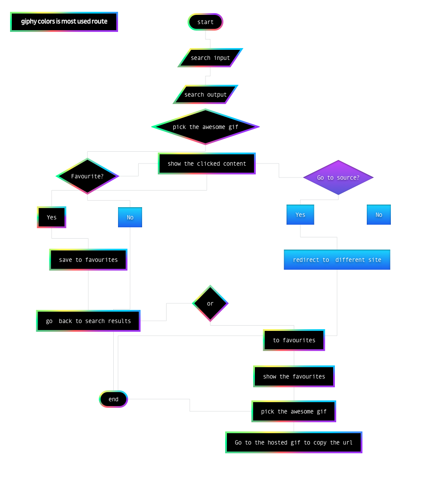
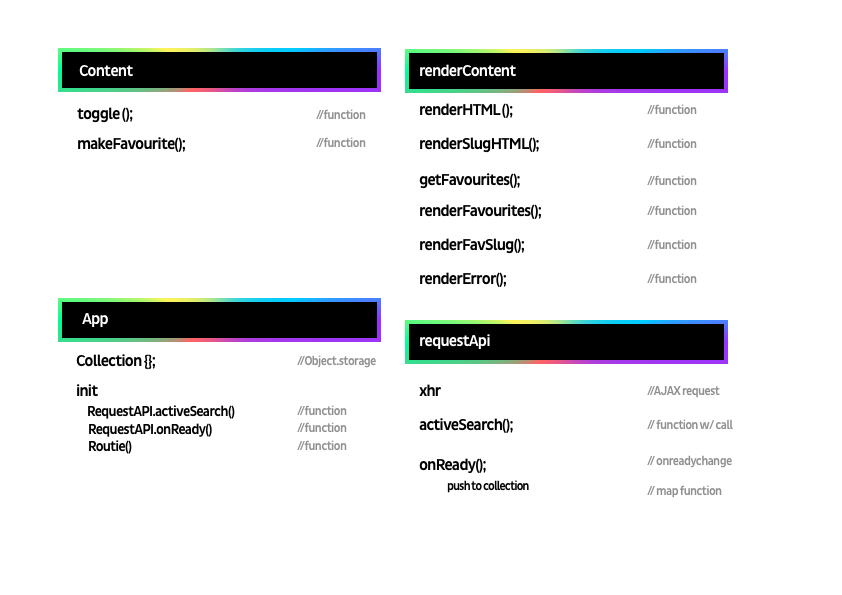

<h1 align="center"> Giphy Search Api! </h1>
<h4 align="center">A Simplified giphy search app where you can favourite your favourite gifs.</h4>

## Key Features
It's a connection with the giphy API to look up your favourite gifs. With this application you can favourite gifs & go to the source of the gif.
you can click on a gif to see what the gif is about and check out the source, date and time. After you saved the favourites you can look at your favourites on the favourites page.







## Flow



## Code
Created my own templating in a sense (example).

```js
let html = `<ul>`;
getItems.forEach(function(d){
  html += `
  <li>
    <a href="#favourites/${d.id}"></a>
    <h3>${d.title}</h3>
  </li>
  `
});
html += `</ul>`;
```

You can find an implementation of JsDocs in my code.
```js
/**
 * Hide the elements by applying the hidden class.
 * @param {String} selector The CSS Selector of the elements to hide
 */
```

A filter function to check if the id is right and render the html.
```js
function filterByID(item) {
  if (item.id === gif) {
    // render the html
  }
  app.collection.filter(filterByID);
}  
```

## Modules



By making use of modules you could see the project work as individual files. To make this more visual I used a _actor diagram_ to visualize the finished product.

```js

let app = (function() {
  // empty variable to store the page data of every search
  var collection = {};

  return {
    init: function(){
      requestAPI.activeSearch();
      requestAPI.onReady();
      routie('gifs');
    }
  }
})();

```

## limitations
There aren't really limitations from the api. But you are loading in moving images and to much would be laggy. There are some options that could help render on slow internet speeds and image renders if you retrieve alot more than 15.

```JSON
images {
  "480w_still":{},
  "downsized":{},
  "fixed":{},
}
/* there are some smaller and downsampled options in the Api */
```

## Credits

I made use of routie to do the routes of the pages and I used the giphy API you can use [here](giphylink tester).
- [routie](routie link)
  routie is a microlibrary that works all the routes in this app. When you click on a link it will recognize the slug/url and will show what page is needed.
- [giphy](giphy api)
  Giphy has an api that retrieves data from their servers and you'll find meta data and urls (of gifs) to use in your app.
  - used from the search api:
    - title
    - source
    - images
    - dateTime
    - username

I made this with object oriented JavaScript (ES5). with a small hint of es6 (used let and const and `` `backticks` ``. to do templating on my own).


## Code reviews
- [Sam](https://github.com/Senmetsu/wafs/commit/f8e3dd1c4105c0c6d7bdf7adea8534561ab69362)
- [Alex](https://github.com/Cascuna/wafs/issues/2)
- [jorik](https://github.com/IIYAMA12)
